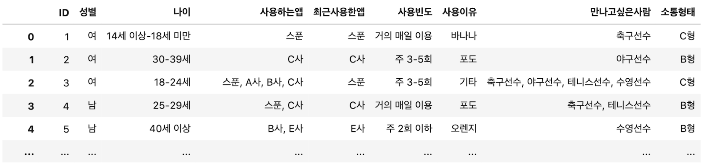
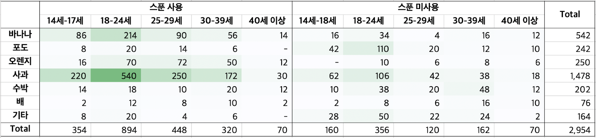
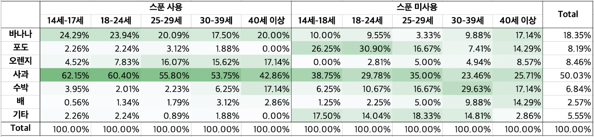
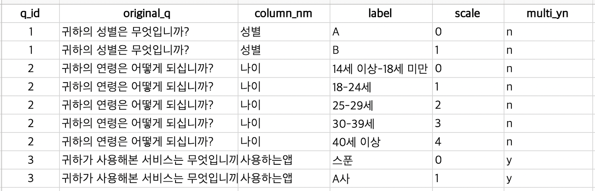

### **개요**

최근 많은 기업에서 다양한 방법의 사용자 조사를 실시하고 있다. 기업 내부 데이터로는 알아내기 힘든 사용자 의견을 수집하고 전략적 방향을 수립하기 위함이다. 그 중 설문은 가장 빠르게 사용자 의견을 수집, 분석할 수 있는 방법이다. 따라서 사용자 경험을 중요하게 여기는 쿠팡, 야놀자, 왓챠 등 많은 IT기업에서는 조사 대행업체에 의뢰하는 것이 아닌 자체 리서치 패널을 구축하여 빠르게 설문 조사를 실시하고, 보다 정확한 데이터를 분석하여 제품 개발 및 전략 수립에 활용하고 있다.

오디오 스트리밍 서비스를 제공하고 있는 [스푼(Spoon)](https://www.spooncast.net/kr/)도 마찬가지다. 최근 스푼은 "스푼만의 오디오 기반 커뮤니티" 컨셉을 발굴하기 위한 설문 조사를 실시하였고 이를 분석하여 전략 방향을 도출하였다.

본 글에서는 '데이터 분석가' 관점에서 겪은 실무를 소개하며 수집된 설문 데이터를 효율적으로 분석하고 인사이트를 도출하였던 경험을 공유하고자 한다. 특히 기업에서 가장 보편적이고 쓰이고 있는 Google Forms 결과 데이터셋을 기준으로 소개한다.

### **분석 목적**

모든 분석이 그렇듯, 목적이 가장 중요하다. 하지만 이번 업무의 분석은 특정 문제 혹은 구체적인 문제를 해결해야 하기 보단 향후 서비스할 기능의 컨셉 발굴을 위해 '탐색적 분석'이 중요했고, 사내 구성원들이 설문으로부터 알고 싶은 다양한 니즈를 해결할 수 있어야 했다. 가령 해결해야 하는 질문들은 아래와 같았다.

Q. 전반적인 설문 결과를 요약해주세요
Q. 다양한 탐색적 분석을 해보면서 눈 여겨볼 만한 결과들을 알려주세요
Q. 향후 오디오 기반 커뮤니티를 구성하는데 필요한 요소들을 알고 싶어요 (가장 중요)
Q. 스푼의 시장확장 관점에서 유저들의 응답 양상이 어떻게 다른지 / 경쟁사 유저들의 응답 양상은 어떻게 다른지 궁금해요
Q. 서비스 국가별로 양상이 다르게 나타날까요・・・ 등

이러한 상황에서 나는 효율적으로 여러 상황에 대응할 수 있는 Python 코드를 짜서 분석을 시행하기로 했다. 특히 스푼은 글로벌 서비스이기 때문에 한 가지 질문에 대한 분석도 4개 지역(한국, 일본, 미국, 중동) 분석이 모두 다뤄져야 하므로 반복 작업을 최소화하는 코드를 짜는 것이 중요했습니다. 또한 앞으로 비슷한 종류의 설문을 시행한다면 같은 로직을 가져갈 수 있기 때문에 장기적 측면에서도 중요하다고 판단되었다.

### **데이터 이해**

설문은 24문항이며 문항들을 크게 분류해보면 다음과 같다.
i) 참여자의 인구통계학적 특성
ii) 현재 사용 중인 온라인・오디오 기반 커뮤니티 형태
iii) 향후 기대하는 오디오 커뮤니티 형태

문항에 따라 단일 선택 응답, 복수 선택 응답(각 문항에 추가 기재 유무 존재), 주관식 응답 등 데이터 형태가 다양했다. 주관식 외 전부 명목형 변수였으며, 복수 선택 응답은 선택한 응답이 콤마(,)로 묶여있었다. (raw 데이터는 보안 이슈 및 독자분들의 이해를 돕기 위해 임시로 생성하였다.)

빠르게 데이터를 이해하기 위해 value_counts 함수로 문항별 응답의 개수, %를 확인했다. 각 컬럼의 unique 값과 개수(혹은 비율)를 빠르게 파악하기 용이해 애용하는 함수다.

### **크로스 집계(교차표분석)**

설문 문항은 대부분 명목형 변수다. 명목형 변수를 가장 효과적으로 분석할 수 있는 방법은 크로스집계(교차표분석)다. 2개 이상 변수의 인과관계를 교차해서 집계하는 분석 기법으로 빠르게 항목 간 인과관계를 파악 할 수 있어 고급 분석이 아니더라도 충분히 유용한 결과를 얻을 수 있다. 엑셀의 피벗 테이블 기능으로도 가능하지만, 설문 문항이 24문항이기 때문에 4개 국가의 수많은 조합을 계산해야 하고 다중 크로스집계 혹은 복수 응답을 처리하는데 불편하기 때문에 Python을 이용하면 매우 효율적이다.

예를 들어 스푼 서비스 사용 유무 및 응답자 연령(독립변수)에 따라 커뮤니티 사용 이유(종속변수)가 다른지 알아보기 위해 크로스 집계한 내용이다. 엑셀 색 강조 규칙을 이용해서 시각화하였다. 보안상 실제 문항을 공개할 수 없는 점 양해 부탁드린다(임의로 과일을 매핑해놓았지만, 실제 문항에는 ‘재미・여가활동을 위해’, ‘정보 교환을 위해’, ‘정서적 지지 교환을 위해’ 등의 문항이 있다).

전반적으로 응답자들은 '사과' 문항에 대한 수요가 높았다. 그리고 스푼 사용자들에겐 '바나나' 문항에 대한 수요가 높고 미사용자에게는 딱히 그렇지 않은 등의 결과를 얻을 수 있었다.

### **크로스 집계: 항목 내 비율로 보기**

안타깝게도 문항을 교차해서 집계해도 눈에 띄는 유의미한 결과가 없었다. 실제로 무의미한 결과일 수도 있겠으나 대부분의 경우 문항 간 응답 수의 차이가 있기 때문에 응답 수가 큰 문항이 단순히 커 보이기 십상이다. 위의 결과 테이블도 스푼 사용자가 미사용자보다 응답 수가 많고 스푼의 18-24세 이하 연령대가 응답 수가 많아서 다른 그룹에 대한 결과가 잘 눈에 띄지 않았다.

이럴때 사용할 수 있는 방법은 비율을 보는 것이다. 예를 들어 앞선 테이블에서 궁금한 것은 스푼 서비스 사용유무 및 응답자 연령(독립변수)에 따라 커뮤니티 사용 이유(종속변수)가 다른지이기 때문에 독립변수의 각 문항 내 응답 수를 비율로 따져보았다.

그 결과, 단순 빈도로 집계했을 때와 다르게 아래와 같은 더욱 풍부한 결과를 얻을 수 있었다.
- 스푼 사용자들은 연령에 상관없이 사과에 대한 수요가 높은 편이나 연령이 높아질수록 그 수요는 낮아진다.
- 25-29세 이상 스푼 사용자들에게 오렌지는 바나나만큼이나 중요한 커뮤니티 사용 목적이다.
- 오렌지는 스푼 사용여부에 상관없이 연령이 높아질 수록 수요가 높아진다.
- 스푼 미사용자들은 사과에 대한 수요가 가장 높으나 그 정도가 스푼 사용자 만큼은 아니며, 포도, 수박, 기타에 대한 수요도 꽤 있는 편이다.

흥미로운 점은 현재 스푼의 콘텐츠 성격이 '사과', '바나나'에 가까운데 비해, 연령이 높은 유저들은 '오렌지'에 대한 수요도 꽤 높은 편으로 나타났다는 것이다. 분석을 수행하기 전까지는 미처 몰랐던 사실이었다. 또한 시장 확장성이 높은 저연령층 이며 현재 스푼 미사용 응답자들은 '포도'에 대한 수요가 꽤 높은 것으로 판단되었다.

이처럼 분석으로 발견된 결과를 통해 스푼 서비스 내에 '오렌지', '포도'와 같은 컨텐츠가 시장 확장을 위해 실제로 활용될 수 있을지에 대한 추가 조사를 제안할 수 있었다. 스푼 사용 여부 및 연령에 따른 커뮤니티 사용 이유 뿐만 아니라 여러 조합의 분석을 이러한 방식으로 크로스집계하고 결과를 보며 해석을 하며 눈에 띄는 점을 정리했다.

### **통계적 검정: 카이제곱 검정**

크로스집계를 통계적으로도 검정할 수 있다. 독립성 검정(카이제곱 검정)을 통해 알아보는 것. 이는 명목형 변수 간 서로 통계적으로 관계가 있는지 판단하는 검정이다.

예를 들어 연령(독립변수)에 따라 커뮤니티 사용 이유(종속변수)가 통계적으로 유의미하게 다른지에 대해 아래 가설을 세울 수 있다. 지면상 카이제곱 검정의 이론적 의미는 생략한다.
- 귀무가설: 연령과 커뮤니티 사용 이유는 관련성이 없다. (= 연령에 따라 커뮤니티 사용 이유가 다르지 않다)
- 대립가설: 연령과 커뮤니티 사용 이유는 관련성이 있다. (= 연령에 따라 커뮤니티 사용이유가 다르다)

Python에서는 scipy의 chi2_contingency 함수를 이용하면 쉽게 결과를 볼 수 있는데, 위 테이블은 카이제곱 통계량이 225.25, p-value가 0.00으로 귀무가설을 기각할 수 있었다. 즉, 연령에 따라 커뮤니티 사용 이유가 다르다고 결론 내릴 수 있다.

다만 카이제곱 검정이 통계적으로 유의미하다는 결론은 "인풋 테이블의 '관찰된 값'과 문항간 합계를 통해 알 수 있는 '기대되는 값'의 차이가 우연하게 발생할 수 있는 확률이라 보기 어렵다" 정도로 해석할 수 있으며, 다소 보수적인 해석이기 때문에 실제 비즈니스적으로 의사 결정 시 일종의 보조 장치 역할을 할 뿐이다. 실제 비즈니스 상황에서 통계적으로 유의하지 않더라고 추가적인 검증을 하기에는 많은 공수가 들기 때문에 유의성에 관계없이 의사 결정하기도 한다.(p-value 값이 얼마나 낮은지 확인하기도 한다.)

참고로 앞의 챕터에서 보았던 테이블은 스푼 사용 여부도 포함된 다중 크로스 집계로 다중 독립변수를 해석하려면 의미가 헷갈려지기 때문에 해석할 수 있는 형태의 독립변수, 종속변수를 검정하는 것이 좋다.

### **리포팅 자동화**

위에서 소개해 드린 과정, 즉 i) 크로스 집계하기, ii) 비율로 나누어보기 iii) 필요하다면 통계적 검정하기의 모든 과정을 1~2개의 테이블로 예시를 들어서 설명했지만, 이번 프로젝트에서는 문항 간 수많은 조합들을 분석하고 사내 구성원들에게 공유했어야 했다.

따라서 이 모든 과정을 처리한 후 각 테이블을 엑셀의 시트 별로 결과를 저장하는 형태를 구상했다. 쉽게 말해 "모든 조합을 다 계산해 놓을 테니 필요한 부분 나도 편하게 보고, 필요한 사람들은 엑셀로 결과 바로 보시게끔 해야겠다"는 생각이었다. 이번 프로젝트의 가장 핵심적인 부분이었다.

여기서 전처리 및 자동화를 위해 가장 중요한 작업은 "매핑 테이블"을 만드는 것이었다. 이 테이블은 각 질문에 어떤 문항(보기)이 있고 그 질문은 단일 응답인지 복수 응답인지, 그리고 보기의 순서는 어떠한지, 컬럼의 실제 질문은 무엇이었는지 등 모든 정보를 담고 있는 Master 테이블이다. 특히 한국어나 영어는 데이터 분석 과정 중에 정보를 인식할 수 있지만, 일본어, 아랍어는 인식이 불가능해 문자를 몰라도 처리가 가능하도록 정교하게 전처리 해야 했고, 이 매핑 테이블이 십분 활용됐다.

이 테이블은 향후 분석 결과를 전달할 때 데이터 구조가 어떠한지 타 구성원에게 설명하는데에도 유용하였다. 이러한 매핑 테이블(코드 테이블) 구조에는 정답이 없으나 통계청 마이크로데이터 서비스의 설문 데이터와 코드집을 참고해서 제작해 보실 수 있다.

결론적으로 자동화를 위해 아래와 같은 스크립트를 작성했다.
1. 크로스집계 시 단일/복수 응답이냐에 따라 집계 방식을 다르게 하도록 각 함수 생성
    1. 분석하는 변수가 단일/복수 응답인지는 매핑테이블 참조
    2. 단일 응답은 pandas 내장 함수 사용
    3. 복수 응답의 경우 매핑 테이블의 문항을 참조해서 그 값이 있는지 없는지 확인해서 카운트
2. 크로스집계 후 항목 간 합계를 계산하도록 함수 생성
3. 크로스집계 테이블에서 독립변수의 항목 내 비율을 계산하도록 함수 생성
4. 크로스집계 테이블 리포팅시 문항들이 실제 문항 순서대로 만들어지도록 순서를 조정하는 함수 생성
    1. 문항 순서는 매핑테이블 참조
5. 데이터프레임을 엑셀 파일로 Unload시 빈도 테이블과 비율 테이블을 한 시트에 저장하고 문항별 결과를 각 시트에 저장하도록 구성

뿐만 아니라 똑같은 응답자가 두번 기록되지 않도록 중복 제거, 데이터 수집 중간(설문 받는 도중)에 항목이 미세하게 수정되었다면 통일하는 등 미리 알 수 없었던 전처리 작업도 계속 병행되었다.

### **분석을 마치며**

크로스 집계, 비율로 보기, 카이제곱 검정 등 비교적 간단한 방법론이지만 전처리 과정이 매우 복잡해서 굉장히 힘들었던 분석이었다. 명목형 변수라 전부 텍스트 타입의 데이터였으며, 일본어 아랍어는 저도 처음 다루어 보아 많이 까다로웠다.(다국어 서비스의 데이터 분석가님들 정말 존경합니다!) 개인적으로 데이터 분석의 80%는 전처리라는 것을 다시금 느끼게 된 프로젝트였다.

하지만 추후 이러한 종류의 설문을 또 시행한다면 특히 Google Form 형태의 데이터라면 코드 수정에 많이 힘을 들이지 않고도 쉽게 대응 가능하기 때문에 장기적인 측면에서 보람을 느낄 수 있었다. 뿐만 아니라 이번 프로젝트의 분석 결과는 전사적으로 공유되어 스푼의 향후 업데이트할 기능의 컨셉 발굴을 위한 자료로 활용되었으며, 향후 더 필요한 조사 과제를 발굴한 점은 나름의 성과였다. 설문 데이터는 기업 내부의 지표만으로는 알아내기 힘든 데이터를 다루기 때문에 사내 구성원들이 잘 모르고 있던 사실을 데이터를 통해 알려주는데 그 가치를 느끼기도 했다.

지금까지 데이터 분석가로서 개인적인 실무와 느낀 점을 공유했다. 긴 글을 읽어주셔서 감사드린다. 많이 부족한 글이지만 누군가에게는 도움이 되었으면 한다.
